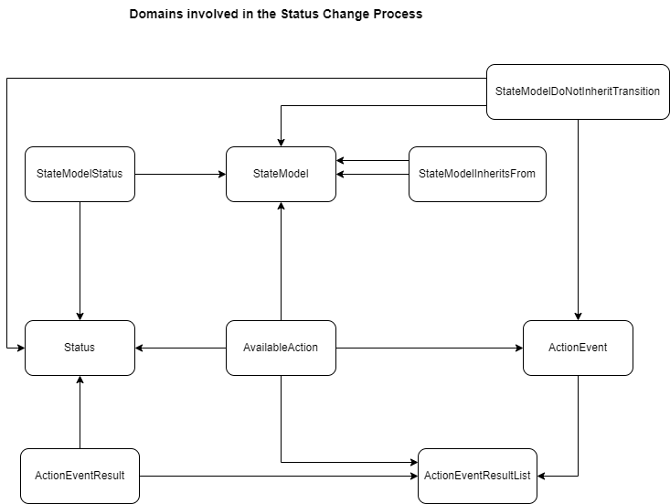

# How to configure what the status is changed to when an action is performed
The setting of of the status for a request is no longer resides in the code, this document gives you an overview on how to configure the status

## Domains
We will talk about it in terms of grails domains, so below is a brief diagram of all the relevant domains.

###	StateModel
Defines the model you are working and has the states, a request can be at, the actions a request can perform and the events that will be triggered associated with this model.
| Property      | Description |
| ------------- | ----------- |
| id            | The id of the model |
| shortcode     | The code for this model|
| name          | A descriptive name for this model |
| initialState  | The initial state of a request using this state model |
| staleAction   | The action to perform when a request is considered stale |
| overdueStatus | The status we set the request to when the request is considered overdue |
| states        | The states that are associated with this state model |

### Status
Defines the various states that a request can be at.
| Property       | Description |
| ---------------- | ----------- |
| id               | The id of the model |
| code             | The code for this status |
| presSeq          | ??? |
| visible          | When being displayed on screen is this status visible or not |
| needsAttention   | When the request is set to this status should the request be marked as needing attention |
| terminal         | Is this status a terminal state (ie. no more actions can be performed) |
| stage            | The stage of the request this status applies to (eg. Preparing, Local, Active, Completed) |
| terminalSequence | The order to show the status in the close manual drop down |

### StateModelStatus
Associates a state with a state model, allowing you to specify specific settings for that state model against that state
| Property    | Description |
| ----------- | ----------- |
| stateModel | The state model the state is associated with |
| state      | The state associated with this the specified model |
| canTriggerStaleRequest | Can this state trigger a stale request scenario |
| canTriggerOverdueRequest | Can this request trigger an overdue request scenario |
| isTerminal               | Does this state mean the request has come to the end of its life with the current location on the rota |
| triggerPullSlipEmail     | Does this state trigger a pull slip email to be sent if one has been configured |

### ActionEvent
Defines the actions and events that can be performed against a request.
| Property              | Description |
| --------------------- | ----------- |
| id                    | The id of the ActionEvent |
| code                  | The code assigned to this action / event |
| description           | A description of what this ActionEvent represents |
| isAction              | Does this record represent an action ? |
| resultList            | The list of results that are used to calculate the new status after performing this action |
| undoStatus            | What do we do if an undo is requested |
| serviceClass          | The class that performs the action / event |
| responderServiceClass | If the request is for a responder and the action / event needs to have different behaviour than if the request was for a requester this class is called instead of the one specified by serviceClass |

### AvailableAction
Defines the actions that are available when the request is in a particular state.
| Property    | Description |
| ----------- | ----------- |
| id          | The id of the AvailableAction |
| model       | The StateModel this AvailableAction belongs to |
| fromState   | The Status that the request is currently in |
| actionCode  | The action code that can be performed when the request is in this state |
| actionEvent | The actionEvent that can be performed when the request is in this state (supercedes actionCode) |
| triggerType | When is this ActionEvent available ([S]ystem, [M]anual or [P]rotocol) |
| actionType  | Redundant, should probably be removed |
| actionBody  | Redundant, should probably be removed |
| resultList  | The list of results that are used to calculate the new status after performing this action, if a potential result is not found here, it will then look at the ActionEventResultList on the actionEvent record |

### ActionEventResultList
Defines a list a list of ActionEventResult records which will inform us what status to transition to when an action or event has completed.
| Property    | Description |
| ----------- | ----------- |
| id          | The id of the record |
| code        | A code we have given this list |
| description | The purpose for this list |
| results     | The ActionEventResult items contained in this list|

### ActionEventResult
Defines what status to transition to if the criteria is met and whether the current status needs to be saved.
| Property           | Description |
| ------------------ | ----------- |
| id                 | The id of the AvailableAction |
| code               | A code we have given this result record |
| description        | The purpose of this result record |
| result             | Was the processing of the action / event successful or not |
| qualifier          | When there are many outcomes from an action / event then a qualifier will be returned to allow use to set the status correctly |
| status             | The status the request should change to or if the saveRestoreState is set this is the status we use to retrieve the status that the reuest should be set to |
| overrideSaveStatus | If we are saving the current state, this allows us to save an alternative state to be restored later |
| saveRestoreState   | Whether we are saving, restoring or neither for this result |
| fromStatus         | If set the request needs to be in a specific state for this result record to be applicable |
| nextActionEvent    | Not implemented yet, intention is to trigger a follow on action or event |

## Method of finding the result
Once the action or event has completed we use the method **lookupStatus** on the service **StatusService** to determine the new status for a request.
The method takes the following parameters
| Parameter | Description |
| --------- | ----------- |
| request | The request that we want to find the status for |
| action | The action or event that was performed |
| qualifier | The qualifier returned from the action / event |
| successful | Did the action / event complete successfully or not |

The method performs the following
1. Looks to see if there is an ActionEvent record for the action / event that was performed, if it cannot find one it logs this as an error and the status does not change.
2. Looks to see if there is an AvailableAction record for the current status and the action / event that was performed, if it cannot find one it logs this as an error and the status does not change.
3. If the resultList is defined on the AvailableAction record it takes that resultList otherwise it uses the resultList on the ActionEvent record
4. We then process each of the ActionEventResult on the found resultList looking for the first result that matches the following criteria
	1. Was the result successful
	2. If the fromStatus is set on the result record it must match the current status.
	3. The qualifier on the result record must match the passed in qualifier (if it is null on the result record then null must be passed in)
5. If we found an ActionEventResult record then we do the following to determine the status
	1. If we need to restore the state then we used the saved state associated with the status property and then clear out that saved state
	2. If we need to save the state then we associate the current status of the request with the status property and then return the status property
	3. If we do not need to save or restore then we just return the value of the status property.
6. If the determined status is null then we set it to the current status.
	